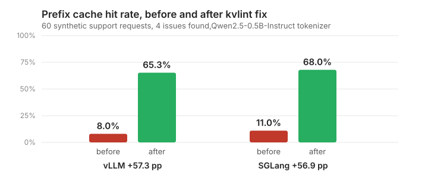

# kvlint

**A linter for your prefix cache.**



```
Hit rate 8.0% to 65.3% after fixing 4 issues (vLLM), 11.0% to 68.0% (SGLang).
```

That is `kvlint demo` on a synthetic support workload. Reproduce it in one
command:

```bash
uvx kvlint demo
```

---

## What it does

kvlint reads real LLM request logs **offline**, with no GPU and no model weights,
and answers four questions:

1. What prefix-cache hit rate would this workload get on **vLLM** and **SGLang**?
2. **Why** is it missing? Which line of which prompt is breaking the cache?
3. How does it degrade as the **KV budget shrinks** and blocks get evicted?
4. What is the **before and after** if the fixes are applied?

Built for teams self-hosting vLLM or SGLang for chat, RAG, and agent workloads.

## Quickstart

```bash
pip install kvlint

kvlint analyze requests.jsonl --model Qwen/Qwen2.5-7B-Instruct
kvlint lint    requests.jsonl --model Qwen/Qwen2.5-7B-Instruct
kvlint fix     requests.jsonl --model Qwen/Qwen2.5-7B-Instruct --apply --out fixed.jsonl
```

Input can be OpenAI chat JSONL, ShareGPT conversations, or plain prompts
(`--format openai|sharegpt|plain`). ShareGPT conversations are expanded into one
cumulative request per user turn, which is how a chat client actually calls the
server.

## What a finding looks like

```
Severity  Rule            Affected  Tokens lost  Fix   Evidence
high      dynamic_time       98.3%        8,483  auto  time value in system prompt changed:
                                                       '2026-09-11T08:01:00Z' vs '2026-09-11T08:00:00Z'
high      user_in_system     98.3%        8,483  auto  per-user field in system prompt changed:
                                                       'user: customer1@example.com' vs 'customer0@...'
low       block_straddle     98.3%        8,483  auto  shared prefix ends at token 22, mid-block
```

Eight rules, each with a positive and a negative test. Full reference in
[docs/RULES.md](docs/RULES.md).

## Validated against a real server

The vLLM simulator has been checked against a live vLLM server, not just against
itself:

| | Value |
|---|---|
| kvlint simulation | 84.0% |
| vLLM 0.29.0 server | 84.0% |
| Absolute error | **0.00 pp** |
| Token counts | matched, 50 of 50 |

The token-count check matters more than the hit rate. It proves kvlint renders
the chat template to the same bytes the server prefills, which is the foundation
everything else rests on. `kvlint validate` performs both checks on every run and
exits non-zero if either fails.

Procedure in [docs/VALIDATION.md](docs/VALIDATION.md). **Eviction under memory
pressure, multi-turn logs, tool schemas, and SGLang are not yet validated against
a real server**, and [docs/METHODOLOGY.md](docs/METHODOLOGY.md) says so.

## Use it in CI

```bash
kvlint lint requests.jsonl --model $MODEL --fail-on high
```

Exit codes: `0` clean, `1` error, `2` findings at or above the threshold.

## Commands

| Command | Does |
|---|---|
| `analyze` | Hit rate for both engines, with an optional KV-budget sweep |
| `lint` | Adds the findings table and the `--fail-on` gate |
| `fix` | Rewrites the log, replays it, reports before and after |
| `validate` | Replays against a live server and compares to its own counters |
| `demo` | Generates a workload with known problems and runs the lot |
| `report` | Renders a saved JSON report as HTML |

`--json` writes a deterministic report: same input and config gives byte-identical
output, so it can be diffed in CI. `--html` needs `pip install 'kvlint[report]'`.

## How it works

- **Two engine models, not one approximation.** vLLM's block-hash chain and
  SGLang's token-level radix tree are simulated separately and reported side by
  side. The gap between them is the cost of vLLM's block rounding.
- **Token-exact attribution.** Findings point at the precise token where two
  prompts stop agreeing, not a 16-token block. That precision is what lets a
  finding quote the timestamp that caused the miss.
- **Auto-fix with replay.** kvlint rewrites the log, re-tokenizes, re-simulates,
  and reports the measured before and after, so the fix is proven rather than
  suggested. It moves content, never deletes it: the model still sees every value
  it saw before.
- **Checked against a real server.** 0.00 pp error on vLLM 0.29.0, with the
  procedure published so you can repeat it.

## When it will not help

Worth knowing before you install it.

- **Your prompts share nothing.** If requests have no common prefix, caching
  cannot help and kvlint will say so rather than invent a number.
- **You use a commercial API.** OpenAI, Anthropic and Gemini cache differently:
  explicit breakpoints, minimum prefix lengths, and time-based expiry rather than
  the LRU block cache kvlint models. Pointing it at those logs would produce a
  confidently wrong answer, so it does not try.
- **Multimodal, LoRA, or cache salting.** These change how the engine builds its
  block hashes. Multimodal input is rejected at ingest rather than silently
  mis-analyzed.

## Documentation

- [METHODOLOGY.md](docs/METHODOLOGY.md): what is measured, simulated, estimated,
  and where it is wrong
- [RULES.md](docs/RULES.md): the eight rules, what fires them and what does not
- [VALIDATION.md](docs/VALIDATION.md): reproducing the live comparison

## Development

```bash
git clone https://github.com/thillai-c/kvlint.git && cd kvlint
uv sync --all-extras
uv run pytest -q                 # offline suite
uv run pytest -m network         # real tokenizers, four model families
uv run pytest -m perf            # throughput benchmarks
```

Python 3.11+. Ruff, mypy strict, and the full suite run in CI on Linux, macOS,
and Windows.

## License

Apache-2.0
